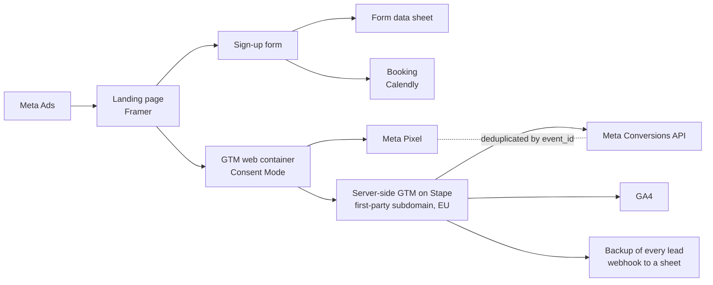

# Case 2 · Server-side tracking: architecture and audit

**Context**: the same fitness and swimming center as Case 1 (anonymized). Before the 2026 season
I audited and rebuilt the tracking, then kept it under a findings register during the campaign.

## Architecture

- **GA4 through the server container** on a first-party subdomain, so measurement does not depend
  only on the browser.
- **Pixel plus Conversions API, deduplicated** with a shared event ID, with Advanced Matching.
- **Consent Mode** respected end to end, tested in three states (granted, denied, not yet chosen).
- **Behavior analytics** (Microsoft Clarity) to see how people use the page.

## The audit: a findings register, not a to-do list

I logged **38 findings**, each with severity (high, medium, low), evidence and status. More than
25 were fixed; the rest were either accepted as documented risks or left open as non-blocking.
Examples of what was fixed:

- Pixel and Conversions API events deduplicated; Advanced Matching configured.
- Consent behavior verified in all three states before launch.
- Debug logging left on in production switched off; orphan triggers removed.
- Personal data kept out of GA4; GA4 and Meta triggers separated on the server.
- A backup that records leads even when cookies are refused.

**Result**: Lead Event Match Quality from **4.4 to 8.7 out of 10**.

**Process**: every change was built in a dedicated workspace and published only after a test. A
tracking setup is certified when it has been tested, not when it has been configured.

## The invisible bug

Some real sign-ups never reached the form's data sheet, with no visible error anywhere.

1. **Pattern**: the lost submissions came from in-app browsers (Facebook and Instagram) on Android.
2. **Root cause**: those browsers auto-filled the hidden anti-spam fields of the form builder, so
   the form silently discarded the submission. I opened a ticket with evidence; the vendor
   confirmed the cause a week later, with no date for a fix.
3. **Recovery**: 5 leads lost during the first test, before any fallback existed, were recovered
   from the server logs.
4. **Mitigation**: a server-side fallback (server GTM plus a webhook to a sheet) that records the
   lead anyway. Since the 13 September update it also covers users who refuse cookies: verified on
   three consecutive real leads.

## Takeaways

- Platform counts are an estimate. The source of truth is a record you control and can reconcile.
- Most of the value of tracking work is in QA: register, severity, evidence, retest.
- When the vendor cannot fix it, design around it and verify with real data.
