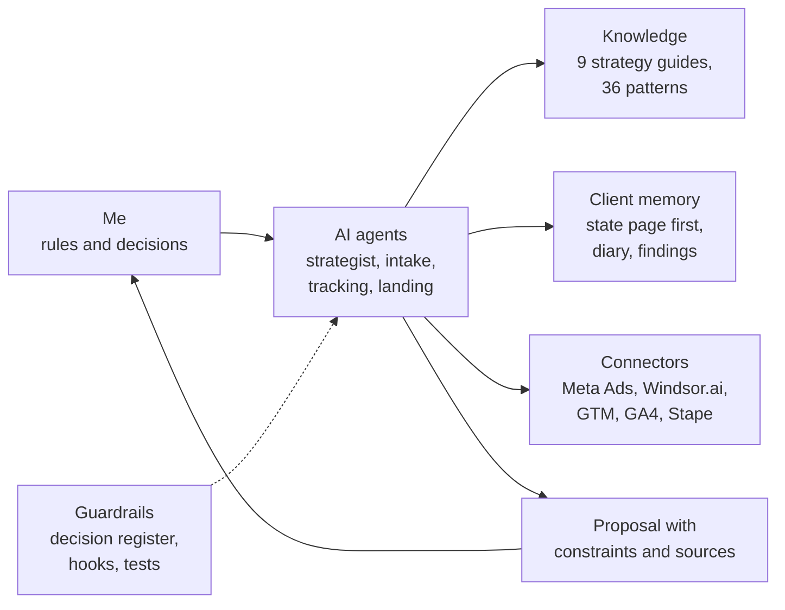

# Case 3 · My AI-assisted framework for freelance marketing

**What it is**: the operating system behind my freelance work on paid ads, tracking and landing
pages. A knowledge base, a memory for every client, task-specific AI agents (Claude Code), live
connectors to the ad and analytics platforms, and guardrails on anything that touches production.
I set the rules and make the decisions; the AI does the reading, the analysis and the first
drafts. The repository is private: this page describes how it is built and how I use it.

## Why I built it

A capable AI assistant, left alone, answers from generic playbooks: "raise the budget", "try
another channel", "trust the platform's numbers". Local clients with small budgets need the
opposite: advice grounded in research I trust, in decisions already taken, and in the client's
real constraints and data. The framework forces that grounding every time.

## How it is structured

- **Strategy library**: nine guides built from deep-research reports I ran and reviewed:
  offer-first Meta strategy, testing and scaling, creative production and diagnosis, lead
  generation and lead quality, server-side data plumbing, anti-bot protection, low budgets,
  strategy by brand stage. Operational guides sit next to them: creative workflow, copywriting,
  conversion optimization, advanced analytics, the tracking and Meta stacks, account onboarding.
- **Client memory**: every client has a short state page that is read in full at every session:
  fixed constraints first (location, who decides the offer, budget ceiling, source of truth for
  leads), then decisions in force, current numbers, open actions, and a "what works" section where
  every insight cites the test that supports it. The day-by-day history goes into a monthly diary,
  the tracking issues into a findings register: both are searched, never read in full.
- **Cross-client patterns**: 26 case patterns and 10 method patterns, each with its source case.
  One client's result is recorded as evidence to verify, not promoted to a rule.
- **AI agents (skills)**: a campaign strategist (analysis, test and scale decisions, budget,
  reporting), a client intake guide (live during a discovery call or from notes: client card,
  go/no-go, quote draft), a tracking operator (GTM web and server-side, GA4, Stape) and a landing
  page builder (paused until a client needs it).
- **Connectors**: Meta Ads (signal quality, event errors, Ad Library), Windsor.ai (performance
  data across platforms), GTM, GA4 and Stape.

## What it enforces

- **Live campaigns are read-only for the AI.** It analyzes and proposes; I make the change in Ads
  Manager.
- **Tracking changes happen in a dedicated workspace** and are published only after a test and
  my explicit OK.
- **Metrics come from real data**: link clicks, not raw clicks; the lead sheet, not the
  platform's count.
- **The platforms' own judgments** (opportunity scores, industry benchmarks, anomaly signals) are
  never used as a basis for advice.
- **Personal data of leads never enters the knowledge base**: pseudonyms only.
- **Every recommendation opens with two visible lines**: the constraints that touch this decision,
  and whether it has already been decided somewhere. It closes with the sources actually read.
- **Code, not memory, enforces the rules**: hooks ask for confirmation before any production
  write (publishing a container, writing to ad platforms) and block excluded tools; a status
  script checks structure, deadlines and backups in seconds.

## How a session runs

1. **Open**: a status digest (open issues, deadlines), then the client's state page, constraints
   first.
2. **Look at reality**: real spend and delivery from the connectors, real leads reconciled against
   the lead sheet and the server logs.
3. **Decide**: the strategist compares numbers with the plan and the patterns, and proposes one
   next step with its constraints and sources. I accept, change or reject it.
4. **Act**: I apply the change on the platform; tracking changes go through the workspace and QA.
5. **Close**: the state page is rewritten (not appended to), the story goes into the diary, one
   short log line, commit and push to a private backup.

## Tests built from real failures

Every time the system got something wrong on client work, the failure became a test case: the
prompt that reproduces it plus 3 or 4 verifiable criteria, run in a fresh read-only session and
judged by a second model. The ones from client work so far:

| Failure | What the test now checks |
|---|---|
| Strategy for a new prospect given from generic knowledge, with invented channels and budgets | The knowledge base is opened before advising; nothing is invented |
| A "next lever" proposed that the client's own constraints excluded | Constraints are re-read first and shown before the recommendation |
| Spend estimated by adding up daily budgets | Real spend only |
| CTR read from raw clicks; the delivery algorithm trusted to pick between variants | Link-click CTR; decisions from the real-lead sheet |
| Test structure mixed up on a small local budget | Different concepts in separate ad sets, variants of one concept in the same ad set |
| A superseded rule still applied | The decision in force wins |

The rule is the one used for software regressions: add the case first, fix the system, verify
that it passes. The same tests qualify a lighter, cheaper model before I trust it with real work.

## What it gives me

- **Speed without losing control**: faster check-ups and reports, every change still mine.
- **Decisions I can trace**: why a lever was pulled, on which data, against which constraint.
- **Mistakes that do not come back**: each one becomes a rule, and each rule a test.
- **A repeatable onboarding**: a new client starts from the same structure, not from zero.
